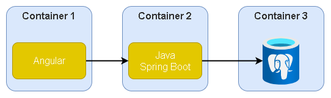
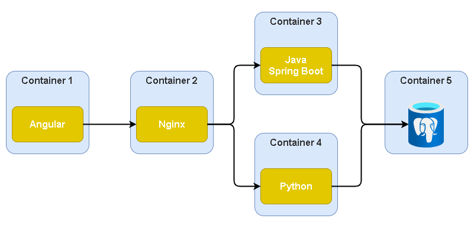

## Apresentação
Este projeto é utilizado para apresentar algumas estratégias de utilização e configuração do Docker.

Para este propósito, utilizei como base o projeto **https://github.com/techtter/scrum-board**.

Na primeira parte da apresentação, o projeto está divido em 3 containers **Docker**:
- Banco de dados Postregs
- Backend Java (Spring Boot)
- Frontend Angular




Na segunda parte, são 5 containers **Docker**:
- Banco de dados Postregs
- Backend Java (Spring Boot)
- Frontend Angular
- Backend Python
- Nginx




### Pre requisitos

Para executar o projeto, é necessário ter instalado o **Docker** e o **Docker Compose**

As instruções de instalação podem ser encontradas nos seguintes endereços:
- **Docker**:
  - [Ubuntu](https://docs.docker.com/install/linux/docker-ce/ubuntu/);
  - [Windows](https://docs.docker.com/docker-for-windows/install/);
  - [Mac](https://docs.docker.com/docker-for-mac/install/).

- O **Dosker Compose** *por padrão, o docker compose já vem instalado no Windows e no Mac
  - [Ubuntu](https://docs.docker.com/compose/install/).


### Como executar?

A V1 do projeto pode ser executado com o seguinte comando:
```
$ docker-compose up -d
```
Para parar as aplicações, utilize o comando:
```
$ docker-compose down
```

A V2 deve ser executada com o comando:

```
$ docker-compose -f docker-compose-canary.yml up -d
```

Para parar as aplicações, utilize o comando:
```
$ docker-compose -f docker-compose-canary.yml down
```

---

#### scrum-postgres (Database)

O banco de dados possui apenas um schema com duas tabelas - Scrum e Task -

O banco de dados pode ser acesso utilizando os seguintes dados:

- Host: *\<host-do-container>*
- Database: *scrum*
- User: *scrum*
- Password: *scrum*

*Obs.: Na V2 do projeto, o banco de dados não está mais acessível fora dos containers do backend

Todas as aplicações estão em containers, logo, a definição de cada um deles pode ser encontrada dentro do arquivo *docker-compose.yml*.

```yml
scrum-postgres:
    image: "postgres:9.6-alpine"
    container_name: scrum-postgres
    volumes:
      - ./scrum-data:/var/lib/postgresql/data
    ports:
      - 5432:5432
    environment:
      - POSTGRES_DB:scrum
      - POSTGRES_USER:scrum
      - POSTGRES_PASSWORD:scrum
```

#### scrum-app-java (REST API)

Aplicação Spring Boot que se conecta com o banco de dados e expõe os endpoints REST que são consumidos pelo Frontend

A lista de todos os endpoints pode ser acessada através do Swagger UI no link: 
**http://\<host-do-container>:8080/api/swagger-ui.html**

As definições do container podem ser encontradas no arquivo *scrum-app-java/Dockerfile*.

#### scrum-app-python (REST API)

Aplicação Python que utiliza o fast-api e expõe, assim como o *scrum-app-java* os endpoints que são consumidos pelo Frontend
Esta aplicação é utilizada na segunda parte do projeto

A lista de todos os endpoints pode ser acessada através do Swagger UI no link: 
**http://\<host-do-container>:8081/docs**

As definições do container podem ser encontradas no arquivo *scrum-app-python/Dockerfile*.

#### scrum-ui (Frontend)

Interface usuária da aplicação onde é possível gerenciar as tarefas dentro do board Scrum.
Esta aplicação consome os endpoinst dinsponibilizados pelo backend *scrum-app*

Para acessar a aplicação, utilize a url **http://\<host-do-container>:4200/**


As definições do container podem ser encontradas no arquivo *scrum-ui/Dockerfile*.

#### Nginx

Servidor web que é utilizado na segunda parte do projeto onde é apresentado a estratégia de release Canary. O Nginx, nesta situação, será utilizado como um balanceador de carga e proxy reverso. 

As definições do container podem ser encontradas dentro do arquivo *docker-compose.yml*.

```yml
  nginx:
    image: nginx
    container_name: nginx
    hostname: nginx
    volumes:
      - ./nginx/default.conf:/etc/nginx/conf.d/default.conf
    ports:
      - 8080:80
    networks:
      - back-scrum
```